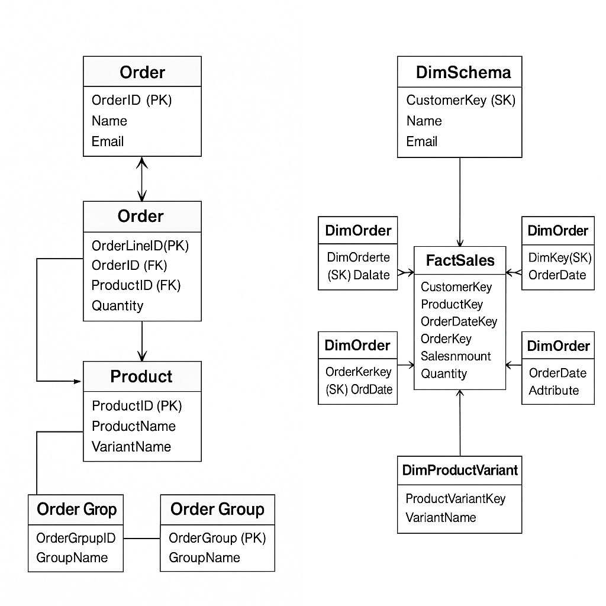

# sql-normalization
End-to-end SQL project demonstrating data normalization (1NF–3NF), dimensional modeling, and OLAP cube design in SSAS.
# SQL Normalization & OLAP Data Warehouse Project

  
  

sql-normalization-and-olap-project/
├── README.md
├── normalization/
│   ├── 01_raw_data.sql
│   ├── 02_1NF.sql
│   ├── 03_2NF.sql
│   ├── 04_3NF.sql
│   ├── 05_final_schema.sql
│   ├── sample_data.sql
│   ├── normalization_diagram.png
│   └── explanation.md
│
├── olap_project/
│   ├── Group15.sln
│   ├── final_project.database
│   ├── final_project.cube
│   ├── final_project.ds
│   ├── final_project.dsv
│   ├── Customer.dim
│   ├── Orders.dim
│   ├── Order Group.dim
│   ├── Products.dim
│   ├── Product Variant.dim
│   └── README_olap.md
│
└── LICENSE

This repository combines two major components:
1. **SQL Normalization Project** – demonstrates step-by-step normalization (1NF→3NF).
2. **OLAP Project (SSAS)** – showcases data-warehouse modeling and cube design using Microsoft SQL Server Analysis Services.

## 🧩 Components

### 1. Normalization
Located in `/normalization/`  
- Shows how a denormalized dataset (customer–order–product) is transformed into a fully normalized relational schema.
- Includes SQL scripts for each stage, sample data, and ER diagrams.

### 2. OLAP Project
Located in `/olap_project/`  
- Includes SSAS files (`.cube`, `.dim`, `.ds`, `.dsv`, `.database`) for multidimensional analysis.
- Dimensions: `Customer`, `Order`, `Product`, `Product Variant`, `Order Group`.
- Cube: `final_project.cube` defines measures and hierarchies.

## 🧰 Tools Used
- Microsoft SQL Server
- SQL Server Management Studio (SSMS)
- SQL Server Data Tools / Visual Studio
- ERDPlus / Lucidchart for diagrams

## 📊 Learning Outcomes
- Data normalization up to 3NF
- Dimensional modeling (star/snowflake schema)
- Cube & dimension creation in SSAS
- ETL understanding (fact & dimension loading)

## 🧑‍💻 Author
**Seyed Ali Shahebrahimi**  
MSc Data Science | Machine Learning Engineer |

